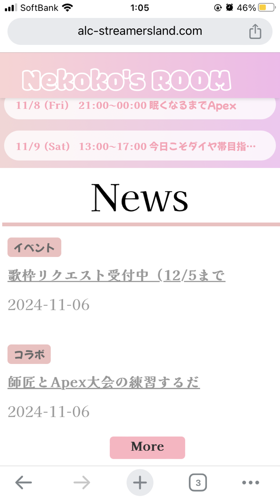

# テンプレートサイトα版(Reactアプリ)  
  
  

## 📌 １分で読めるプロジェクト概要・背景  
本プロジェクトは、個人ストリーマー向けに、ファン向けの情報発信が簡単にできるオリジナルサイトのパッケージの開発・検証を目的としています。知人から、「個人ストリーマーが手軽にスケジュールやグッズなどのニュースを積極的に発信できる専用サイトを提供できるのか」という相談を受けました。知人はかつて個人で配信活動を行っており、ファンへ情報を伝える難しさに直面しました。配信活動を引退した彼は、同じ悩みを抱える個人ストリーマーの支援を目的としたサービスができないかと考え、このプロジェクトに私を誘ってくれました。私自身も相談を受けた当時、未経験からエンジニアへのキャリアチェンジを考えていたため、開発経験を積むことを目的に参加を決意しました。

`※「個人ストリーマー」とは、事務所に所属せず、個人で配信活動を行っている方々を指します。`  

## 🐈　簡単な自己紹介  

ここではYunuと申します。開発は今回が初めてで、2024年4月より未経験からWebエンジニアを目指しています。５月に知人からweb開発の提案があり、独学で学びながら現在も開発に奮闘中です。拙い所はまだたくさんありますが、エンジニアリングを通したものづくりがとても楽しく、今回の開発経験が今後のキャリアにも活かせられるよう精進します。  

## 🌐 URL  

https://alc-streamersland.com/custom-page  【テンプレートサイト（仮）】   

## 🛠️　プロジェクトメンバー  

| メンバー | 役割 |
| -------- | ---- |
| 私 （Yunu)      | フロントエンド、バックエンド、技術開発担当 |
| 知人（Hiro)     | ビジネス設計、マーケティング担当、元配信者 |

## ⚙️ 採用した技術

| 技術                  | バージョン | 役割／特徴／選定理由 |
| --------------------- | ---------- | -------------------- |
| **React**             | 18.0       | メインUIとして使用。コンポーネントベースで再利用性が高く、ユーザーインタラクションが多い管理画面に適しているため。シンプルで拡張性のある構造が、動的な表示やUX向上に寄与。|
| **Material-UI**       | 5.x        | 管理画面のデスクトップ表示を最適化するために採用。統一感あるUIを簡単に構築でき、Reactとの相性も良い点から採用しました。|
| **Axios**             | 0.27       | APIとの通信に使用。非同期通信を簡素化し、Railsバックエンドからのデータ取得を効率的に行うため。|
| **React Router**      | 6.x        | ページ遷移やルーティングの管理に使用。シングルページアプリケーションの利便性を高め、スムーズなページ間移動を実現しました。|
| **Big Calendar**      | -        | 最初はFullCalendarを使用してみたが、CSSやUIのカスタマイズが少し扱いやすかったためです。スタイルやデザインをプロジェクトに合わせて調整しやすく、管理画面の一貫した見た目を保ちやすかった|
| **Sakura Rental Server** | -       | Reactアプリケーションのデプロイ先として使用。国内ユーザーに対して安定した低遅延の運用が可能。|

## ⚙️ 試してみたが採用しなかった技術

| 技術                  | バージョン | 備考 |
| --------------------- | ---------- | ---- |
| **WordPress**         | -          | 当初はシンプルなサイト構築のためにWordPressで十分だと考えていましたが、カスタムテンプレート作成に限界を感じました。また、管理画面とのAPI連携やニュース、スケジュール投稿などの細かい機能を実装する際に、柔軟性や機能の拡張に制約があったため、他の技術に切り替えました。|
| **PHP・Laravel**      | 8.3 / 10   | WordPressと併用し、初期段階で試用しました。しかし、ReactやRailsと比べて設定やAPIの管理が複雑で、思うように開発が進まなかったため、ReactとRailsに切り替えました。Railsは豊富なライブラリや学習リソースがあり、効率的に開発を進めるための柔軟性が高かった点も切り替えの理由です。|

## 課題と今後に向けて  
現在、いくつかの技術的な課題が残っています。   

### 課題  
 
* ページの読み込み速度に改善の余地があり、特に画像や動画コンテンツが多いページでユーザーエクスペリエンスを損なっている。
* バリデーション処理がクライアント側とサーバー側で冗長に実装されており、メンテナンス性が低い。
* セキュリティ面での課題があり、ログアウト後もセッションが保持され、アクセスが可能になってしまう場合がある。
* バックエンドのAPIエンドポイントが増えるにつれて、CORSエラーの管理が複雑になっている。

### 今後の施策  
* 画像の最適化やLazy Loadの導入、キャッシュ機能の活用により、ページの読み込み速度を向上させる。
* バリデーションを一元管理し、フロントエンドとバックエンド間で共通化することで、コードの重複を削減し、保守性を向上させる。
* セッション管理を強化し、ログアウト時にキャッシュクリアやローカルストレージの削除を行う処理を追加する。また、トークンの有効期限設定や自動セッションタイムアウトを導入する。
* CORS設定を見直し、エンドポイントごとに適切なポリシーを適用する。また、APIゲートウェイやリバースプロキシを導入し、API管理をスムーズに行えるようにする。

## 総括  
ここまでお読みくださりありがとうございました。 
開発を進めれば進めるほど、浮き彫りになってくる様々な課題を一つ一つ解消していく過程も含めて楽しめました。まずは実際に物が作れるかどうかが自身の課題であったため、そこをまずクリアできたことは少し安心しています。今後はセキュリティやサーバー面の知識もしっかり学び、資格も取ってWeb開発で幅広く活躍できるエンジニアとして成長していきたいです。  
