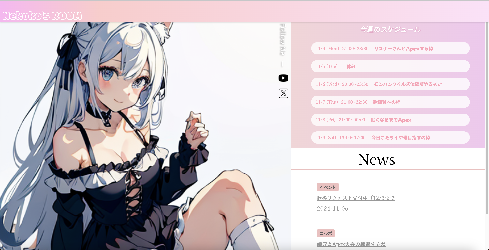

# テンプレートサイトα版(Reactアプリ)

  

## 📌 １分で読めるプロジェクト概要・背景  
本プロジェクトは、個人ストリーマー向けに、ファン向けの情報発信が簡単にできるオリジナルサイトのパッケージの開発・検証を目的としています。知人から、「個人ストリーマーが手軽にスケジュールやグッズなどのニュースを積極的に発信できる専用サイトを提供できるのか」という相談を受けました。知人はかつて個人で配信活動を行っており、ファンへ情報を伝える難しさに直面しました。配信活動を引退した彼は、同じ悩みを抱える個人ストリーマーの支援を目的としたサービスができないかと考え、このプロジェクトに私を誘ってくれました。私自身も相談を受けた当時、未経験からエンジニアへのキャリアチェンジを考えていたため、開発経験を積むことを目的に参加を決意しました。

`※「個人ストリーマー」とは、事務所に所属せず、個人で配信活動を行っている方々を指します。`  

## 🐈　簡単な自己紹介  

ここではYunuと申します。開発は今回が初めてで、2024年4月より未経験からWebエンジニアを目指しています。５月に知人からweb開発の提案があり、独学で学びながら現在も開発に奮闘中です。拙い所はまだたくさんありますが、エンジニアリングを通したものづくりがとても楽しく、今回の開発経験が今後のキャリアにも活かせられるよう精進します。  

## 🌐 URL  

確認済の環境：Google Crome,Safari  
レスポンシブデザイン対応：iPhone 8,iPhone SE,iPhone XR,iPhone 12 Pro,iPhone 14 Pro Max(androidなど他デバイスは順次対応）  

同時にバックエンドのリポジトリも公開しております。[こちら](https://github.com/yunu0705/TestAppRails)からどうぞ。  

https://alc-streamersland.com/custom-page  【テンプレートサイト（仮）】  

https://alc-streamersland.com/register  【ユーザー登録画面】  

https://alc-streamersland.com/login  【ログイン画面】 ユーザー名 `adminuser` パスワード `test1234`  をログイン画面でご入力ください。

現段階では以下の機能に限ってご利用いただけます。  
 
#### ✅ 使用可能な機能
 * ログイン・ログアウト
 * スケジュール投稿・編集・削除  
 * ニュース投稿・編集・削除

#### ⛔ 停止中の機能  
 * ユーザー新規登録の送信  
 * パスワード再発行の送信  
 * お問い合わせフォームの送信

## 🛠️　プロジェクトメンバー  

| メンバー | 役割 |
| -------- | ---- |
| 私 （Yunu)      | フロントエンド、バックエンド、技術開発担当 |
| 知人（Hiro)     | ビジネス設計、マーケティング担当、元配信者 |

## ⚙️ 採用した技術

| 技術                  | バージョン | 役割／特徴／選定理由 |
| --------------------- | ---------- | -------------------- |
| **React**             | 18.0       | メインUIとして使用。コンポーネントベースで再利用性が高く、ユーザーインタラクションが多い管理画面に適しているため。シンプルで拡張性のある構造が、動的な表示やUX向上に寄与。|
| **Material-UI**       | 5.x        | 管理画面のデスクトップ表示を最適化するために採用。統一感あるUIを簡単に構築でき、Reactとの相性も良い点から採用しました。|
| **Axios**             | 0.27       | APIとの通信に使用。非同期通信を簡素化し、Railsバックエンドからのデータ取得を効率的に行うため。|
| **React Router**      | 6.x        | ページ遷移やルーティングの管理に使用。シングルページアプリケーションの利便性を高め、スムーズなページ間移動を実現しました。|
| **Big Calendar**      | -        | 最初はFullCalendarを使用してみたが、CSSやUIのカスタマイズが少し扱いやすかったためです。スタイルやデザインをプロジェクトに合わせて調整しやすく、管理画面の一貫した見た目を保ちやすかった|
| **Sakura Rental Server** | -       | Reactアプリケーションのデプロイ先として使用。国内ユーザーに対して安定した低遅延の運用が可能。|

## ⚙️ 試してみたが採用しなかった技術

| 技術                  | バージョン | 備考 |
| --------------------- | ---------- | ---- |
| **WordPress**         | -          | 当初はシンプルなサイト構築のためにWordPressで十分だと考えていましたが、カスタムテンプレート作成に限界を感じました。また、管理画面とのAPI連携やニュース、スケジュール投稿などの細かい機能を実装する際に、柔軟性や機能の拡張に制約があったため、他の技術に切り替えました。|
| **PHP・Laravel**      | 8.3 / 10   | WordPressと併用し、初期段階で試用しました。しかし、ReactやRailsと比べて設定やAPIの管理が複雑で、思うように開発が進まなかったため、ReactとRailsに切り替えました。Railsは豊富なライブラリや学習リソースがあり、効率的に開発を進めるための柔軟性が高かった点も切り替えの理由です。|

## Reactアプリを作る時に意識したこと

1. **モバイルファーストのレスポンシブデザイン**  
メインの利用デバイスをスマートフォンと想定し、先にレスポンシブデザインの学習に取り組みました。Chrome DevToolsを活用して、様々なサイトのHTMLとCSSコードを観察しながら、ChatGPTを活用しつつ手探りでイメージに近づけました。
     実際本番環境に移すとレイアウトが少し崩れていたことから、適切な設定についてさらに追求、学習していきます。

3. **Webパフォーマンスの最適化**  
本番環境に移行した際に初回読み込み速度の遅延を経験し、Webの高速化が重要であると認識しました。サイトの軽量化やパフォーマンス最適化の知識をさらに深め、ユーザーにより快適な体験を提供できるようにしていきたいと考えています。
     読み込み速度が改善されるまでは、ローディング用の画像やアニメーション効果をつけることによってサイトの離脱を防ぐ効果を自身で改めて実感しました。

3. **入力フォームのバリデーションルールと連動した視覚効果**  
登録フォームの使いやすさと見やすさを意識し、バリデーションと連動した視覚効果を工夫しました。特に、PCとスマホでデザイン性や制限が異なる点に注目し、各デバイスに最適化されたインターフェースを提供するため、さまざまなサイトを参考にしました。UI/UXの改善に役立つデザインや効果のアイデアを得ることができました。
 
## 総括  
ここまでお読みくださりありがとうございました。フロントエンドは見た目にすぐ反映されるため、1pxでもずれているのを見つけるたび修正して全体がよくなっていく過程を楽しめる分野だなと改めて感じました。  
レスポンシブデザインが一番苦労したので、他に良い作り方がないか今後も色んなところにアンテナを張って技術を吸収します。

